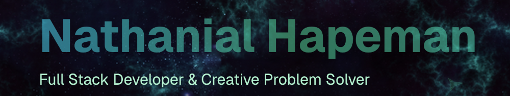

# Portfolio Website

A modern, space-themed portfolio website built with Next.js, TypeScript, and Tailwind CSS featuring animated backgrounds and interactive elements.

## Features

- **Hero Section**: Split-layout landing page with profile image, introduction, and social links
- **Experience Timeline**: Professional work history with company details and achievements
- **Projects Showcase**: Interactive project cards with detailed descriptions, technologies, and live demos
- **Books Collection**: Visual display of favorite books in a grid layout
- **Animated Space Background**: Custom parallax background with:
  - Animated spaceships with AI-based pathfinding
  - Floating asteroids with physics
  - Twinkling stars
  - Three zig-zagging space invader aliens (purple, orange, green)
- **Responsive Design**: Fully responsive across all devices
- **Analytics Integration**: Google Analytics setup for tracking visitor data
- **Smooth Navigation**: Fixed navbar with smooth scrolling to sections

## Tech Stack

- **Framework**: Next.js 16 (App Router)
- **Language**: TypeScript
- **Styling**: Tailwind CSS v4
- **Icons**: React Icons
- **Analytics**: Google Analytics via @next/third-parties
- **Fonts**: Geist Sans & Geist Mono

## Code Quality

This project uses automated code formatting and linting:

- **Prettier**: Auto-formats code on save (VSCode) and on commit
- **ESLint**: Lints and auto-fixes issues with Next.js best practices
- **Husky + lint-staged**: Pre-commit hooks ensure all committed code is formatted

**Available commands:**

```bash
npm run lint          # Check for linting issues
npm run format        # Format all files with Prettier
npm run format:check  # Check formatting without modifying files
```

**VSCode setup:** Settings are configured in `.vscode/settings.json` for format-on-save. Install recommended extensions when prompted.

## Getting Started

### Prerequisites

- Node.js 18+
- npm or yarn

### Installation

```bash
# Clone the repository
git clone <your-repo-url>
cd nhapeman_v5

# Install dependencies
npm install

# Set up environment variables
cp .env.local.example .env.local
# Add your Google Analytics ID to .env.local:
# NEXT_PUBLIC_GA_ID=G-XXXXXXXXXX

# Run the development server
npm run dev
# Open http://localhost:3000 in your browser
```

## Customization

### Personal Information

Update the following files with your information:

1. **Hero Section** (`components/sections/Hero.tsx`):
   - Profile image path
   - Your name
   - Tagline/title
   - Bio description
   - Email and social media links
   - Location

2. **Experience Data** (`lib/data.tsx`):
   - Add your work experience with company details
   - Update job titles, periods, and descriptions
   - Add relevant tags/technologies

3. **Projects Data** (`lib/data.tsx`):
   - Add your projects with images, descriptions, and links
   - Update technologies used
   - Include GitHub URLs and live demo links
   - Add detailed project descriptions with media

4. **Books Collection** (`lib/data.tsx`):
   - Add your favorite books with cover images
   - Update authors and titles

5. **Metadata** (`app/layout.tsx`):
   - Update title and description for SEO

### Styling

- Colors and styles can be customized in Tailwind classes
- Global styles are in `app/globals.css`
- Space background can be adjusted in `components/ParallaxSpace.tsx`
- Alien colors and animations in `components/Alien.tsx` and `components/ParallaxSpace.tsx`

### Adding Images

- **Profile image**: Place in `public/logos/me.jpg`
- **Project images**: Place in `public/logos/` and reference in `lib/data.tsx`
- **Company logos**: Place in `public/logos/` for experience section
- **Book covers**: Place in `public/books/` for books section

## Building for Production

```bash
# Build the optimized production bundle:
npm run build

# Start the production server:
npm start
```

## Deployment

This project can be deployed to various platforms:

### Vercel (Recommended)

[](https://vercel.com/new)

### Other Platforms

- **Netlify**: Connect your git repository
- **AWS Amplify**: Follow AWS documentation for Next.js

## Project Structure

```
nhapeman_v5/
├── app/
│   ├── layout.tsx          # Root layout with ParallaxSpace background
│   ├── page.tsx            # Home page with all sections
│   └── globals.css         # Global styles and animations
├── components/
│   ├── sections/
│   │   ├── Hero.tsx        # Hero section with split layout
│   │   ├── Experience.tsx  # Work experience timeline
│   │   ├── Projects.tsx    # Projects showcase with modals
│   │   ├── Books.tsx       # Books collection grid
│   │   └── Contact.tsx     # Contact information (in Footer)
│   ├── Navbar.tsx          # Navigation component
│   ├── Footer.tsx          # Footer component
│   ├── ParallaxSpace.tsx   # Animated space background
│   └── Alien.tsx           # Reusable alien SVG component
├── lib/
│   └── data.tsx            # Portfolio data (projects, experience, books, skills)
├── types/
│   └── index.ts            # TypeScript type definitions
└── public/
    ├── logos/              # Images and logos
    ├── books/              # Book cover images
    └── resume.pdf          # Resume file
```

## Animated Background

The space-themed background (`ParallaxSpace.tsx`) features:

- 3 AI-controlled spaceships that navigate randomly
- 10 rotating asteroids with wrapping physics
- 50 twinkling stars
- 3 zig-zagging aliens in different colors (purple, orange, green)
- Parallax scrolling effects

To customize the aliens:

- Adjust colors in the `<Alien>` component calls in `ParallaxSpace.tsx`
- Modify speeds and positions in the alien animation logic
- Change alien count or add more with different behaviors

## License

MIT License - feel free to use this template for your own portfolio!

## Support

For issues or questions, please open an issue in the GitHub repository.
